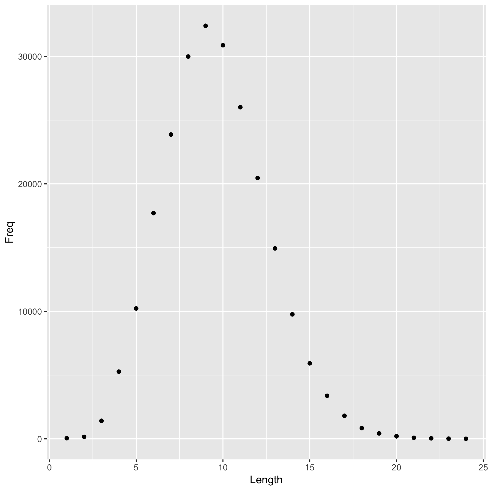
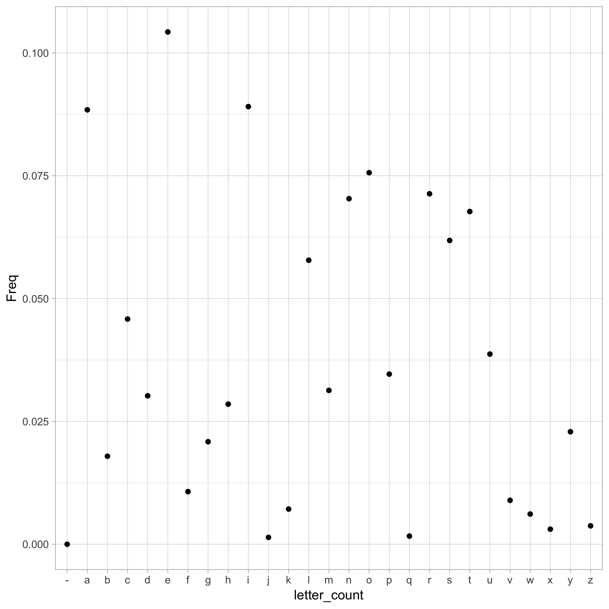

# Word length done by Jenny


On most *nix systems, the file `/usr/share/dict/words` contains a bunch of words. On my machine, it contains 235886 words.

I computed the length of each word, i.e. the number of characters, and tabulated how many words consist of 1 character, 2 characters, etc.

The most frequent word length is 9.

Here is a histogram of word lengths.




# Letter frequencies from word.txt
For the next session, I extracted letter frequency from words/txt.

First take a glance at the words inside words.txt:

```r
words <- readLines("./data/words.txt")
str(words)
```

```
##  chr [1:235886] "A" "a" "aa" "aal" "aalii" "aam" "Aani" "aardvark" ...
```

It contains 235886 distinct words. I extracted every word and compute a letter frequency among all the words in the text file. 

Here is the result of letter frequencies.


