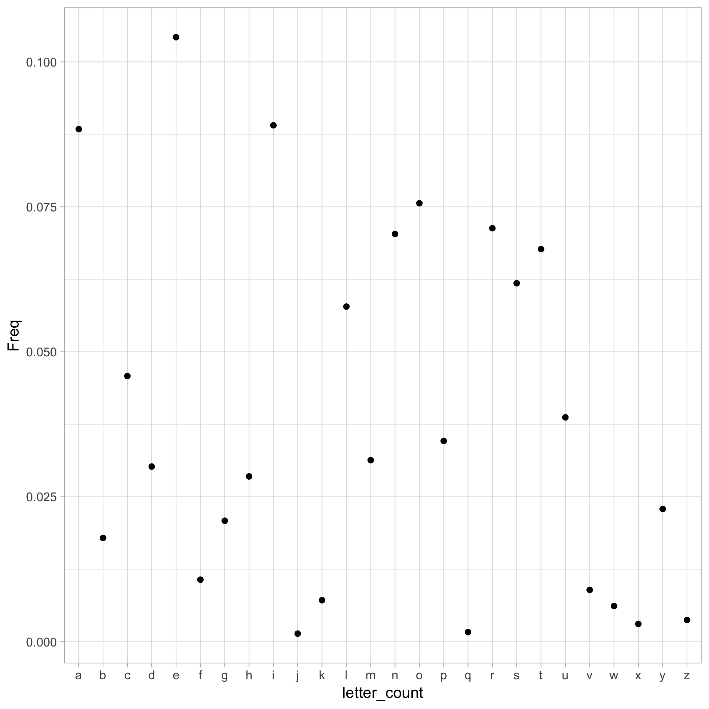

# Word length done by Jenny
```{r load-hist-dat, include = FALSE}
hist_dat <- read.delim("./tsv_output/histogram.tsv")
```

On most *nix systems, the file `/usr/share/dict/words` contains a bunch of words. On my machine, it contains `r sum(hist_dat$Freq)` words.

I computed the length of each word, i.e. the number of characters, and tabulated how many words consist of 1 character, 2 characters, etc.

The most frequent word length is `r with(hist_dat, Length[which.max(Freq)])`.

Here is a histogram of word lengths.


# Letter frequencies from word.txt
For the next session, I extracted letter frequency from words/txt.

First take a glance at the words inside words.txt:
```{r}
words <- readLines("./data/words.txt")
str(words)
```

It contains 235886 distinct words. I extracted every word and compute a letter frequency among all the words in the text file. 

Here is the result of letter frequencies.


